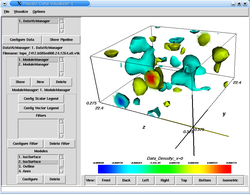
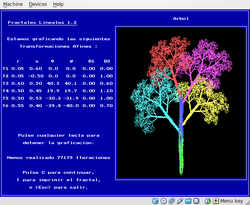
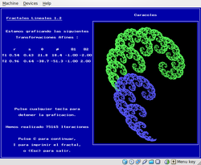

(attic)=
# The research attic

These are projects I have worked on in the past, sometimes just paper
abstracts and links to their full text.

(instantons)=
## The topology of the QCD vacuum

The topic of my physics PhD dissertation at [CU Boulder](http://physics.colorado.edu) was the topological structure of the QCD vacuum at finite temperature, as modeled by lattice simulations where space-time is discretized into a finite four-dimensional grid where the Feynman path integral for the QCD Lagrangian can be approximated (the finite spacing of the grid acts as an ultraviolet regulator for the continuum theory). This work was conducted under the supervision of professor [Anna Hasenfratz](http://www-hep.colorado.edu/~anna), one of the most remarkable combinations of raw intellectual talent and human kindness I\'ve had the pleasure to meet.

We looked for signs that could confirm a hypothesis posited by Shuryak and others, where instantons and anti-instantons (particular configurations of the gauge background known to play an important dynamical role in several aspects of QCD) should pair up in \'molecules\' that would be preferentially aligned along the time axis of space-time. While we did find some tell-tale signs of these configurations, it was unfortunately never a strong enough signal to draw definitive conclusions on the matter. I have not followed more recent research on this topic so I don\'t know what the final word on this question is, if any.

<figure class="align-center">

<figcaption>Gauge field configuration with instanton-like structures,
visualized with MayaVi (the old version).</figcaption>
</figure>

If you are interested, my dissertation contains all the details (and as is common with such documents, it is probably a decent summary of many techniques and ideas in the lattice QCD field, so hopefully it may be of use to students entering this domain): 

:::{admonition} Thesis

F. Pérez, [Instanton Correlations in the Finite Temperature QCD Vacuum](../papers/thesis_fperez.pdf), Ph.D. dissertation, Department of Physics, University of Colorado at Boulder, 2002.
:::

## Plasma physics

Two-dimensional simulations of beam-driven turbulence in the auroral ionosphere have shown the formation and instability of phase-space tubes. These tubes are a generalization of electron phase-space holes in a one-dimensional plasma. In a strongly magnetized plasma, such tubes vibrate at frequencies below the bounce frequency of the trapping potential. A theory for these vibrations yields quantitative agreement with kinetic simulations. Furthermore, the theory predicts that the vibrations can become unstable when resonantly coupled to electrostatic whistlers --- also in agreement with simulations.

:::{admonition} Paper

M.V. Goldman, D.L. Newman and F. Pérez. [Dynamics and Instability of
Electron Phase-Space Tubes](../papers/etubes01_go-new-pe_prl.pdf), Phys.
Rev. Lett. 86, 1239-1242 (2001).
:::

## Semi-classical chaos

We attempt to construct Lyapunov exponents for quantum mechanical systems. Lyapunov exponents have always been a key concept of classical chaotic dynamics, but difficult to use in a quantum context. By constructing a semi-classical potential from the ground state wavefunction of a system and analyzing the classical dynamics produced by this potential, one can use concepts from classical dynamics, such as Lyapunov exponents, to probe the dynamics of the quantum system. In this manner, we find non trivial corrections to the classical dynamics arising from quantum information: the chaotic behavior is suppressed although not entirely eliminated.

:::{admonition} Preprint

J. Mahecha and F. Pérez, [A semi-classical approach for Lyapunov
exponents of a quantum mechanical
system](../papers/quantum_lyap_short.pdf), Universidad de Antioquia
preprint, 2002.
:::

## Hamiltonian chaos in 3-body systems

I worked under the direction of professor [Jorge Mahecha](http://leucippus.udea.edu.co/portal) on developing numerical tools for the accurate integration of the general (Coulomb) 3-body problem, by regularizing the two-body collisions with the introduction of a new time variable in the Hamiltionan. This was then used them to study a number of interesting configurations of this system, both chaotic and regular. This system is of interest in the study of semi-classical chaotic behavior of doubly-excited atoms.

If you happen to be interested in the sources, drop me a line (fairly clean C code though I haven\'t run it for years so it may need some updates for modern compilers, but it was purely numerical code so there are no dependencies).

:::{admonition} Papers

A. Santander, J. Mahecha and F. Pérez, [Rigid Rotator and Fixed shape
solutions to the Coulomb Three-Body
Problem](../papers/rigid_coul3d97_sa-ma-pe.pdf). Few Body Systems, 22:1,
37-60 (1997).

F. Pérez and J. Mahecha. [Classical trajectories in Coulomb three body
systems](../papers/traj_coul3d96_pe-ma.pdf). Rev. Mex. Física 42:6,
1070-1086 (1996).
:::

## Fractals and iterated function systems

As an undergraduate student in [Physics at the Universidad de Antioquia (Colombia)](http://fisica.udea.edu.co), I developed under the supervision of professor [Manuel J. Páez](http://fisica.udea.edu.co/~mpaez) my first reasonably complex computational project using the tools of the day. Like many undergraduates in physics and math at the time, I decided to program the creation of fractals via [Iterated Function Systems](http://en.wikipedia.org/wiki/Iterated_function_system) using the \"chaos game\" algorithm. The code was initially written in Turbo Pascal on a PC XT clone with monochrome Hercules graphics, later upgraded to a 386 with glorious 16-color VGA. This little project actually grew a fair bit, mostly thanks to prof. Páez\'s combination of an unrelenting stream of new ideas and requirements backed with steady support. Eventually it was awarded a national educational software award and commercialized for a few years in Colombia (I didn\'t know anything about the Internet or open source software at the time).

<figure class="align-center">

<figcaption>A simple IFS defined by only two affine transforms produces
surprisingly rich patterns, like these 'snails'.</figcaption>
</figure>

Remarkably, you can still run it under Windows XP. I use Linux for all my work, but I have tested this in a VirtualBox XP machine (that\'s how these screenshots were taken). If you have interest in this type of code archeology, grab the full archive (in [zip](/code/fraclin.zip) or [tgz](/code/fraclin.tgz) format) that contains the original TurboPascal sources (in Spanish!) and a DOS binary. This paper describing the software and its uses for teaching interesting mathematical ideas is also in Spanish:

:::{admonition} Paper

F. Pérez. [Los fractales: una alternativa interactiva para la enseñanza
de la matemática](../papers/fraclin_ense92_pe.pdf). Informática
Educativa, 5:1, 35-42 (1992).
:::

**NB** I see that prof. Páez has actually created modern versions of this type of tool, for example the fractal tree above can now be [rendered in your browser](http://fisica.udea.edu.co/~mpaez/JTree/Tree.html) (the implementation is a Java applet).
